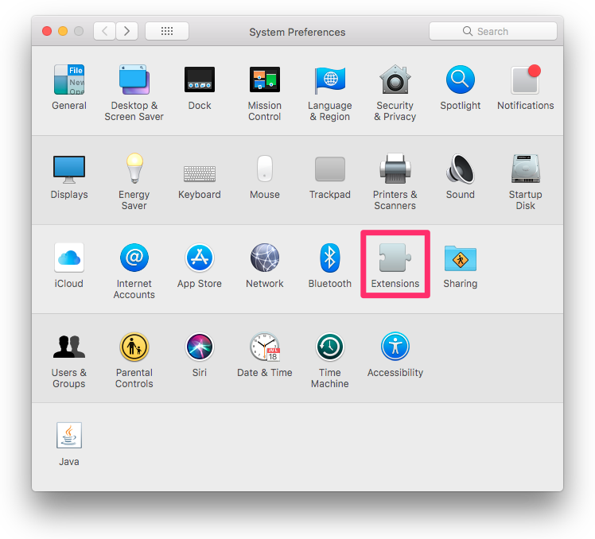
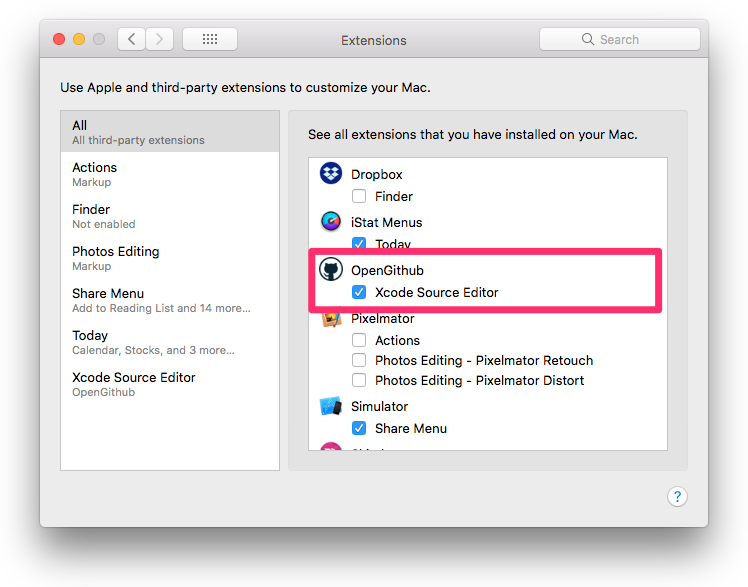
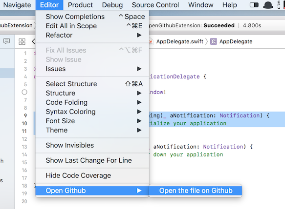

# Open Github

This is Xcode extension for easily opening the file with Github displayed on Xcode.

## Usage

### Setup

1. Download the app from [Release](https://github.com/Watson1978/OpenGithub/releases) page.
2. Launch the app.
3. Open the `System Preferences` from macOS's menu bar.
4. Select `Extensions`.

5. Turn on `Xcode Source Editor` in `OpenGithub`.

### Use the extension

1. Open the source code in Xcode.
2. Select `Open Github` in Editor menu.

3. The source code will be opened with Github on your browser.

If you select a region in source code on Xcode, of cource, it will have a selecting region in your browser.
